# Customer Service Agent System Design

**Date:** 2026-03-07  
**Project:** Beauty Salon Customer Service Agent System  
**Platform:** nanobot + PostgreSQL + Docker  

---

## 1. Executive Summary

This document describes the architecture for a multi-container customer service system built on nanobot. The system provides:

- **Omnichannel support**: Telegram, WhatsApp, Discord integration
- **Role-based access**: Admin/Owner vs Normal Customer
- **Unified customer identity**: Cross-IM customer recognition
- **Business functions**: Service inquiry, booking, appointments, reminders
- **Security**: Topic guardrails, spam control, operation audit

---

## 2. System Architecture

### 2.1 High-Level Overview

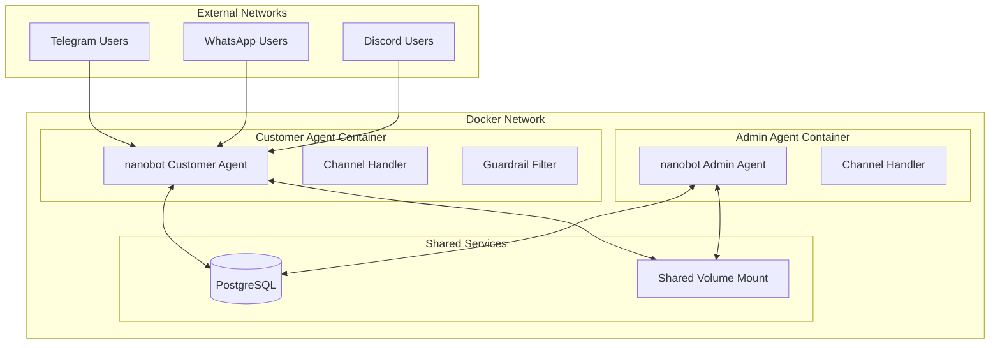

### 2.2 Agent Responsibilities

| Agent | Container | Responsibilities |
|-------|-----------|------------------|
| **Customer Agent** | Instance A | Handle customer queries, bookings, appointments, provide service info |
| **Admin Agent** | Instance B | System settings, configuration changes, data backup/restore, customer management |

### 2.3 Container Deployment

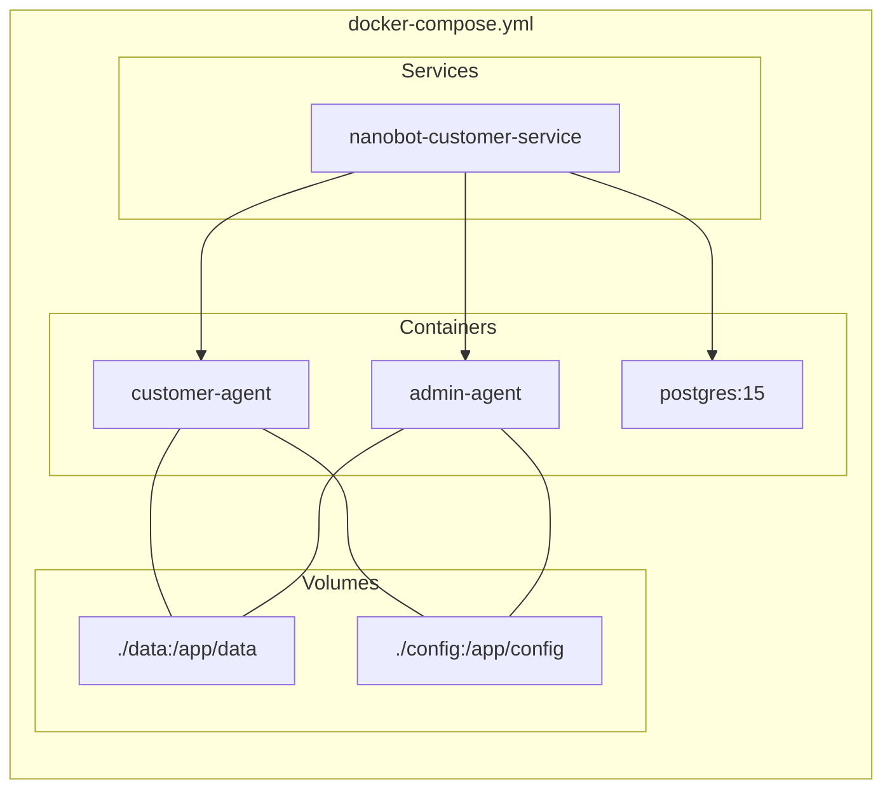

### 2.4 Shared Mounted Folder Structure

```
./data/
├── customer-agent/
│   ├── workspace/
│   │   ├── MEMORY.md
│   │   ├── HEARTBEAT.md
│   │   └── sessions/
│   ├── cron/
│   └── skills/
├── admin-agent/
│   ├── workspace/
│   │   ├── MEMORY.md
│   │   ├── HEARTBEAT.md
│   │   └── sessions/
│   ├── cron/
│   └── skills/
├── backups/
│   ├── configs/
│   └── database/
└── logs/
    ├── customer-agent.log
    └── admin-agent.log

./config/
├── customer-agent/
│   └── config.json
└── admin-agent/
    └── config.json
```

---

## 3. Database Schema

### 3.1 ER Diagram

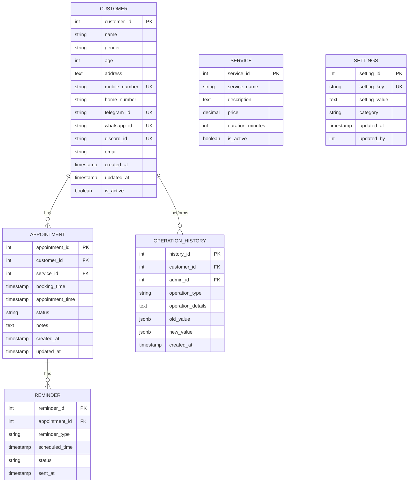

### 3.2 Table Definitions

#### 3.2.1 customers

```sql
CREATE TABLE customers (
    customer_id SERIAL PRIMARY KEY,
    name VARCHAR(255),
    gender VARCHAR(20),
    age INT,
    address TEXT,
    mobile_number VARCHAR(50) UNIQUE,
    home_number VARCHAR(50),
    telegram_id VARCHAR(50) UNIQUE,
    whatsapp_id VARCHAR(50) UNIQUE,
    discord_id VARCHAR(50) UNIQUE,
    email VARCHAR(255) UNIQUE,
    customer_notes TEXT,
    is_active BOOLEAN DEFAULT TRUE,
    created_at TIMESTAMP DEFAULT NOW(),
    updated_at TIMESTAMP DEFAULT NOW()
);

CREATE INDEX idx_customers_telegram ON customers(telegram_id);
CREATE INDEX idx_customers_whatsapp ON customers(whatsapp_id);
CREATE INDEX idx_customers_discord ON customers(discord_id);
CREATE INDEX idx_customers_mobile ON customers(mobile_number);
```

#### 3.2.2 services

```sql
CREATE TABLE services (
    service_id SERIAL PRIMARY KEY,
    service_name VARCHAR(255) NOT NULL,
    description TEXT,
    price DECIMAL(10, 2) NOT NULL,
    duration_minutes INT NOT NULL,
    category VARCHAR(100),
    is_active BOOLEAN DEFAULT TRUE,
    created_at TIMESTAMP DEFAULT NOW(),
    updated_at TIMESTAMP DEFAULT NOW()
);

-- Sample data
INSERT INTO services (service_name, description, price, duration_minutes, category) VALUES
('Haircut', 'Professional haircut and styling', 35.00, 30, 'hair'),
('Hair Coloring', 'Full hair coloring service', 85.00, 120, 'color'),
('Hair Treatment', 'Deep conditioning treatment', 55.00, 45, 'treatment'),
('Manicure', 'Professional nail service', 25.00, 30, 'nails'),
('Pedicure', 'Foot nail care service', 30.00, 40, 'nails'),
('Facial', 'Deep cleansing facial', 65.00, 60, 'skincare');
```

#### 3.2.3 appointments

```sql
CREATE TABLE appointments (
    appointment_id SERIAL PRIMARY KEY,
    customer_id INT NOT NULL REFERENCES customers(customer_id),
    service_id INT NOT NULL REFERENCES services(service_id),
    booking_time TIMESTAMP DEFAULT NOW(),
    appointment_time TIMESTAMP NOT NULL,
    status VARCHAR(20) DEFAULT 'pending',
    notes TEXT,
    created_at TIMESTAMP DEFAULT NOW(),
    updated_at TIMESTAMP DEFAULT NOW()
);

CREATE INDEX idx_appointments_customer ON appointments(customer_id);
CREATE INDEX idx_appointments_time ON appointments(appointment_time);
CREATE INDEX idx_appointments_status ON appointments(status);
```

#### 3.2.4 operation_history

```sql
CREATE TABLE operation_history (
    history_id SERIAL PRIMARY KEY,
    customer_id INT REFERENCES customers(customer_id),
    admin_id INT,
    operation_type VARCHAR(50) NOT NULL,
    operation_details TEXT,
    old_value JSONB,
    new_value JSONB,
    ip_address VARCHAR(45),
    created_at TIMESTAMP DEFAULT NOW()
);

CREATE INDEX idx_operation_history_customer ON operation_history(customer_id);
CREATE INDEX idx_operation_history_type ON operation_history(operation_type);
CREATE INDEX idx_operation_history_created ON operation_history(created_at);
```

#### 3.2.5 reminders

```sql
CREATE TABLE reminders (
    reminder_id SERIAL PRIMARY KEY,
    appointment_id INT NOT NULL REFERENCES appointments(appointment_id),
    reminder_type VARCHAR(20) NOT NULL,
    scheduled_time TIMESTAMP NOT NULL,
    status VARCHAR(20) DEFAULT 'pending',
    message_text TEXT,
    sent_at TIMESTAMP,
    created_at TIMESTAMP DEFAULT NOW()
);

CREATE INDEX idx_reminders_appointment ON reminders(appointment_id);
CREATE INDEX idx_reminders_scheduled ON reminders(scheduled_time);
CREATE INDEX idx_reminders_status ON reminders(status);
```

#### 3.2.6 settings

```sql
CREATE TABLE settings (
    setting_id SERIAL PRIMARY KEY,
    setting_key VARCHAR(100) UNIQUE NOT NULL,
    setting_value TEXT,
    category VARCHAR(50),
    description TEXT,
    updated_at TIMESTAMP DEFAULT NOW(),
    updated_by INT
);

-- Default settings
INSERT INTO settings (setting_key, setting_value, category, description) VALUES
('business_name', 'Beauty Salon', 'general', 'Business name'),
('business_hours_weekday', '09:00-20:00', 'schedule', 'Weekday business hours'),
('business_hours_weekend', '10:00-18:00', 'schedule', 'Weekend business hours'),
('appointment_buffer_minutes', '30', 'booking', 'Minimum buffer between appointments'),
('max_advance_booking_days', '30', 'booking', 'Maximum days ahead for booking'),
('reminder_before_hours', '24', 'reminder', 'Hours before appointment to send reminder'),
('guardrail_enabled', 'true', 'security', 'Enable topic guardrail'),
('rate_limit_per_minute', '10', 'security', 'Maximum messages per minute per user');
```

#### 3.2.7 users (Admin/Owner)

```sql
CREATE TABLE users (
    user_id SERIAL PRIMARY KEY,
    username VARCHAR(100) UNIQUE NOT NULL,
    password_hash VARCHAR(255) NOT NULL,
    role VARCHAR(20) NOT NULL,
    full_name VARCHAR(255),
    email VARCHAR(255),
    is_active BOOLEAN DEFAULT TRUE,
    created_at TIMESTAMP DEFAULT NOW(),
    updated_at TIMESTAMP DEFAULT NOW()
);

-- Default admin (password: admin123)
INSERT INTO users (username, password_hash, role, full_name) VALUES
('admin', '$2b$12$LQv3c1yqBWVHxkd0LHAkCOYz6TtxMQJqhN8/X4.VT5YcG7RE.WbS', 'owner', 'System Owner');
```

---

## 4. User Roles & Permissions

### 4.1 Role Hierarchy

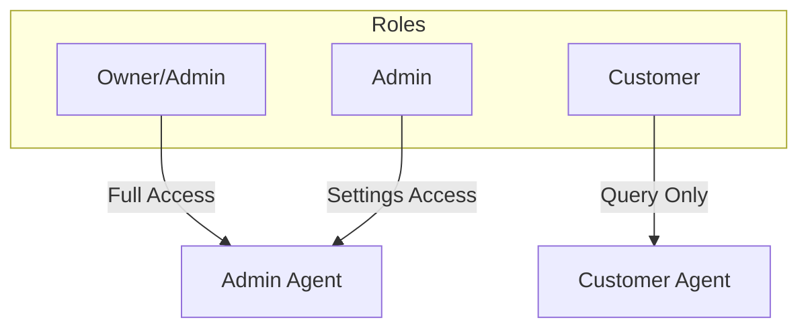

### 4.2 Permission Matrix

| Feature | Owner | Admin | Customer |
|---------|-------|-------|----------|
| View all customers | ✅ | ✅ | ❌ |
| Edit customer info | ✅ | ✅ | ❌ |
| Delete customer | ✅ | ❌ | ❌ |
| Change system settings | ✅ | ✅ | ❌ |
| View operation history | ✅ | ✅ | ❌ |
| Make bookings | ✅ | ✅ | ✅ |
| Cancel own appointments | ✅ | ✅ | ✅ |
| View own history | ✅ | ✅ | ✅ |
| Data backup/restore | ✅ | ✅ | ❌ |
| Manage services | ✅ | ✅ | ❌ |

---

## 5. Message Flow & Processing

### 5.1 Message Processing Pipeline

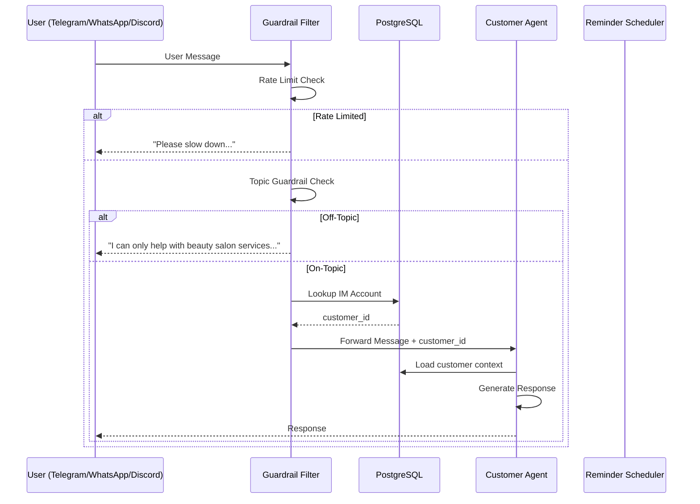

### 5.2 IM Account Resolution Flow

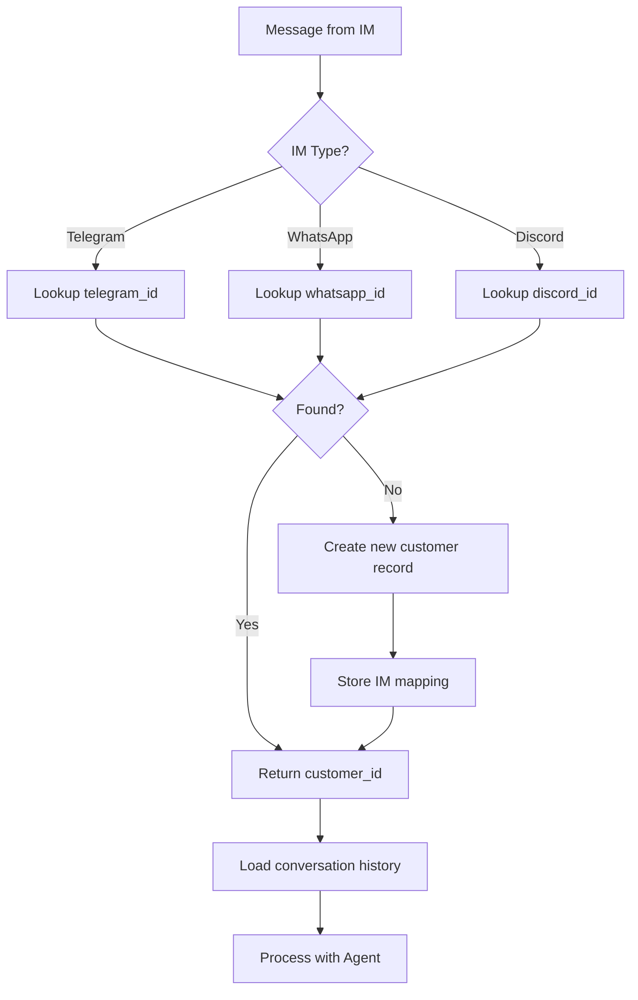

---

## 6. Customer Service Functions

### 6.1 Service Functions Overview

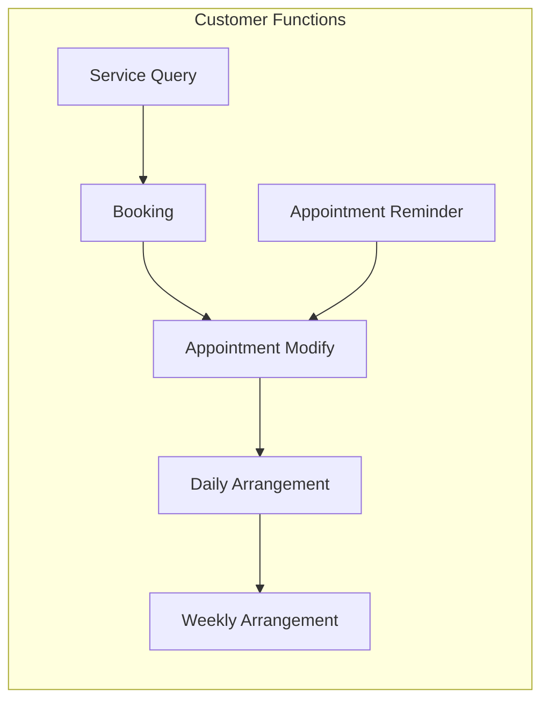

### 6.2 Service Query

```
User: "What services do you offer?"
Agent: Lists services with prices and durations

User: "How much for hair coloring?"
Agent: Returns service details from services table
```

### 6.3 Booking Flow

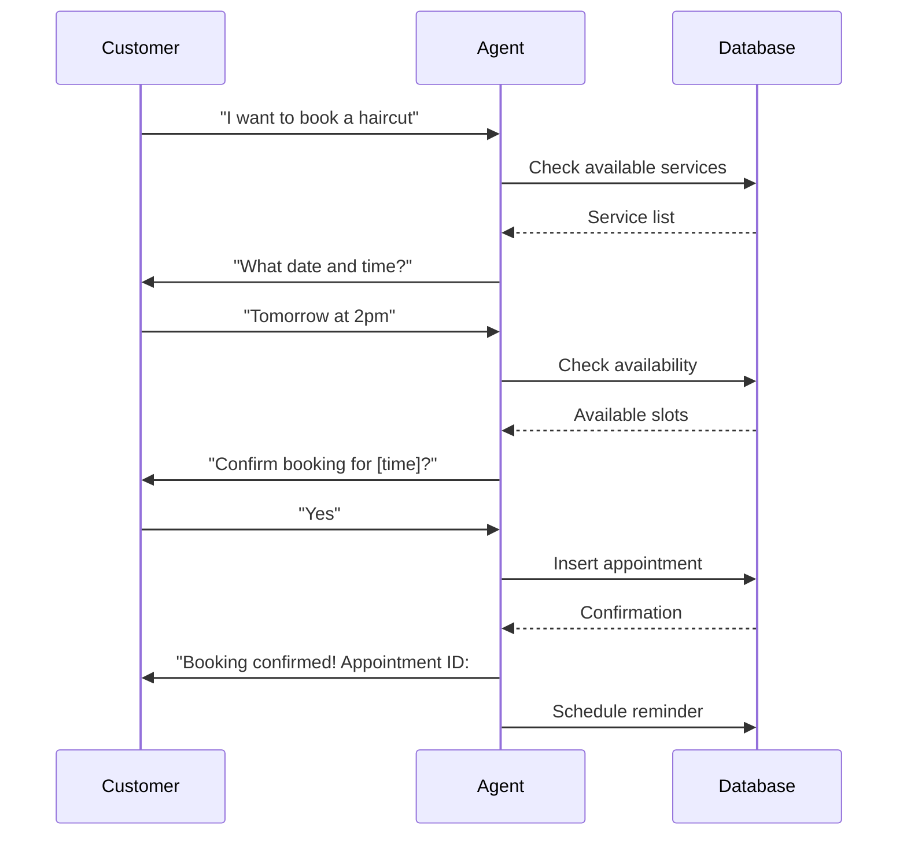

### 6.4 Appointment Modification

```
User: "I need to change my appointment"
Agent: Look up customer's appointments
Agent: "Your appointment is tomorrow at 2pm. What would you like to change?"
User: "Change to 4pm"
Agent: Update appointment_time, log operation_history
Agent: "Appointment updated to 4pm"
```

### 6.5 Appointment Reminder

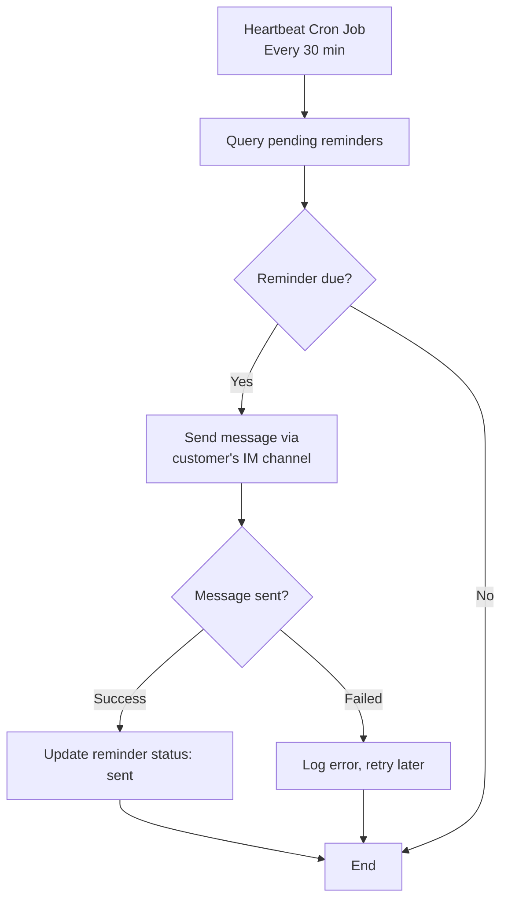

### 6.6 Daily/Weekly Working Arrangement

```
User: "What are your working hours?"
Agent: Query settings table, return business_hours

User: "What appointments do you have today?"
Agent: Query appointments for today, list all bookings
(Admin only)
```

---

## 7. Security & Guardrails

### 7.1 Topic Guardrail

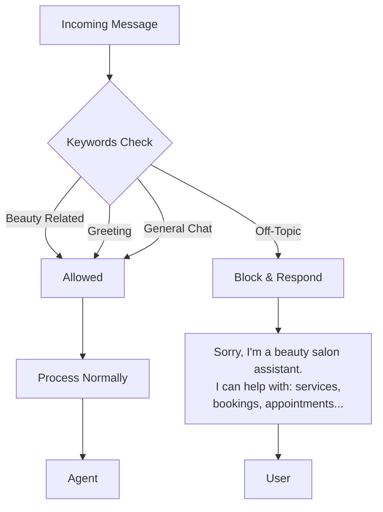

**Allowed Topics:**
- Haircut, styling, coloring, treatment
- Booking, appointments, scheduling
- Pricing, services, products
- Salon hours, location

### 7.2 Spam Control

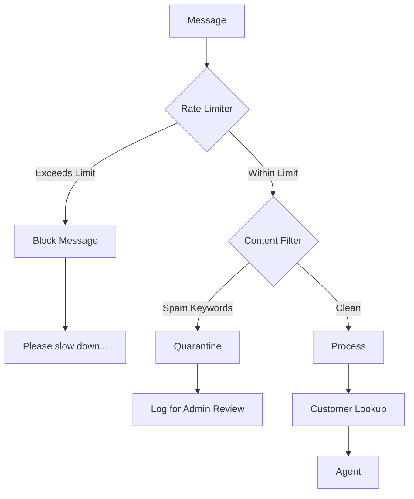

**Rate Limits:**
- 10 messages per minute per user
- 50 messages per hour per user

**Spam Keywords:**
- Configurable blocklist in database
- Automatic detection of repetitive content

### 7.3 Customer Duplicate Prevention

```sql
-- Unique constraints already prevent duplicates
-- Additional check before insert
CREATE OR REPLACE FUNCTION check_customer_duplicate()
RETURNS TRIGGER AS $$
BEGIN
    IF EXISTS (
        SELECT 1 FROM customers 
        WHERE (NEW.telegram_id IS NOT NULL AND telegram_id = NEW.telegram_id)
           OR (NEW.whatsapp_id IS NOT NULL AND whatsapp_id = NEW.whatsapp_id)
           OR (NEW.discord_id IS NOT NULL AND discord_id = NEW.discord_id)
           OR (NEW.mobile_number IS NOT NULL AND mobile_number = NEW.mobile_number)
    ) THEN
        RAISE EXCEPTION 'Customer with this IM account or phone already exists';
    END IF;
    RETURN NEW;
END;
$$ LANGUAGE plpgsql;

CREATE TRIGGER trg_customer_duplicate
    BEFORE INSERT ON customers
    FOR EACH ROW
    EXECUTE FUNCTION check_customer_duplicate();
```

---

## 8. Operation History & Audit

### 8.1 Operation Types

| Operation | Type | Recorded Data |
|-----------|------|---------------|
| Customer created | `customer_create` | new_value |
| Customer updated | `customer_update` | old_value, new_value |
| Appointment booked | `booking_create` | customer_id, appointment_id |
| Appointment modified | `booking_update` | old_value, new_value |
| Appointment cancelled | `booking_cancel` | appointment_id |
| Settings changed | `settings_update` | old_value, new_value, admin_id |
| Login | `user_login` | user_id, ip_address |

### 8.2 Query Examples

```sql
-- Get all operations for a customer
SELECT * FROM operation_history 
WHERE customer_id = 123 
ORDER BY created_at DESC;

-- Get all settings changes
SELECT * FROM operation_history 
WHERE operation_type = 'settings_update'
ORDER BY created_at DESC;

-- Get admin activity
SELECT u.username, oh.* 
FROM operation_history oh
JOIN users u ON oh.admin_id = u.user_id
WHERE oh.admin_id IS NOT NULL
ORDER BY oh.created_at DESC;
```

---

## 9. Data Backup & Restore

### 9.1 Backup Strategy

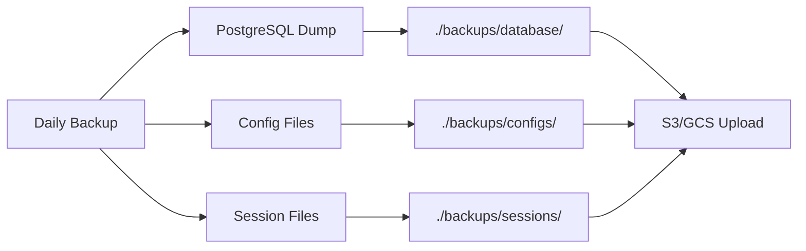

### 9.2 Backup Script

```bash
#!/bin/bash
# backup.sh

DATE=$(date +%Y%m%d_%H%M%S)
BACKUP_DIR="./backups"

# Database backup
pg_dump -h postgres -U nanobot -Fc nanobot_db > "$BACKUP_DIR/database/backup_$DATE.dump"

# Config backup
tar -czf "$BACKUP_DIR/configs/config_$DATE.tar.gz" ./config/

# Session backup (optional)
tar -czf "$BACKUP_DIR/sessions/sessions_$DATE.tar.gz" ./data/*/workspace/sessions/

# Keep only last 7 days
find "$BACKUP_DIR" -type f -mtime +7 -delete

echo "Backup completed: $DATE"
```

### 9.3 Restore Script

```bash
#!/bin/bash
# restore.sh

BACKUP_FILE=$1

if [ -z "$BACKUP_FILE" ]; then
    echo "Usage: ./restore.sh <backup_date>"
    exit 1
fi

# Restore database
pg_restore -h postgres -U nanobot -d nanobot_db "./backups/database/backup_$BACKUP_FILE.dump"

# Restore configs
tar -xzf "./backups/configs/config_$BACKUP_FILE.tar.gz" -C ./

echo "Restore completed"
```

---

## 10. Docker Deployment

### 10.1 docker-compose.yml

```yaml
version: '3.8'

services:
  postgres:
    image: postgres:15-alpine
    environment:
      POSTGRES_DB: nanobot_db
      POSTGRES_USER: nanobot
      POSTGRES_PASSWORD: ${DB_PASSWORD}
    volumes:
      - postgres_data:/var/lib/postgresql/data
      - ./init.sql:/docker-entrypoint-initdb.d/init.sql:ro
    networks:
      - nanobot-net

  customer-agent:
    build: .
    command: nanobot gateway
    volumes:
      - ./data/customer-agent:/app/workspace
      - ./config/customer-agent:/app/config
      - ./backups:/app/backups
    environment:
      - NANOBOT_CONFIG=/app/config/config.json
      - DB_HOST=postgres
    depends_on:
      - postgres
    networks:
      - nanobot-net

  admin-agent:
    build: .
    command: nanobot gateway
    volumes:
      - ./data/admin-agent:/app/workspace
      - ./config/admin-agent:/app/config
      - ./backups:/app/backups
    environment:
      - NANOBOT_CONFIG=/app/config/config.json
      - DB_HOST=postgres
    depends_on:
      - postgres
    networks:
      - nanobot-net

  cron-scheduler:
    build: .
    command: python -m nanobot.cron.service
    volumes:
      - ./data/customer-agent:/app/workspace
    environment:
      - DB_HOST=postgres
    depends_on:
      - postgres
    networks:
      - nanobot-net

networks:
  nanobot-net:
    driver: bridge

volumes:
  postgres_data:
```

### 10.2 Customer Agent Config

```json
{
  "channels": {
    "telegram": {
      "enabled": true,
      "token": "${TELEGRAM_TOKEN}",
      "allowFrom": ["*"]
    },
    "whatsapp": {
      "enabled": true,
      "allowFrom": ["*"]
    },
    "discord": {
      "enabled": true,
      "token": "${DISCORD_TOKEN}",
      "allowFrom": ["*"]
    }
  },
  "agents": {
    "defaults": {
      "model": "anthropic/claude-opus-4-5",
      "systemPrompt": "You are a professional beauty salon customer service agent. Only respond to beauty salon related queries. Be polite and helpful."
    }
  },
  "database": {
    "host": "${DB_HOST}",
    "port": 5432,
    "name": "nanobot_db",
    "user": "nanobot",
    "password": "${DB_PASSWORD}"
  }
}
```

---

## 11. API Endpoints (Optional Admin Panel)

### 11.1 Customer Management

| Method | Endpoint | Description |
|--------|----------|-------------|
| GET | `/api/customers` | List all customers |
| GET | `/api/customers/:id` | Get customer details |
| POST | `/api/customers` | Create customer |
| PUT | `/api/customers/:id` | Update customer |
| DELETE | `/api/customers/:id` | Delete customer |

### 11.2 Appointments

| Method | Endpoint | Description |
|--------|----------|-------------|
| GET | `/api/appointments` | List appointments |
| GET | `/api/appointments/:id` | Get appointment |
| POST | `/api/appointments` | Create appointment |
| PUT | `/api/appointments/:id` | Update appointment |
| DELETE | `/api/appointments/:id` | Cancel appointment |

### 11.3 Settings

| Method | Endpoint | Description |
|--------|----------|-------------|
| GET | `/api/settings` | Get all settings |
| PUT | `/api/settings/:key` | Update setting |

### 11.4 Backup

| Method | Endpoint | Description |
|--------|----------|-------------|
| POST | `/api/backup` | Trigger backup |
| POST | `/api/restore` | Restore from backup |

---

## 12. Implementation Roadmap

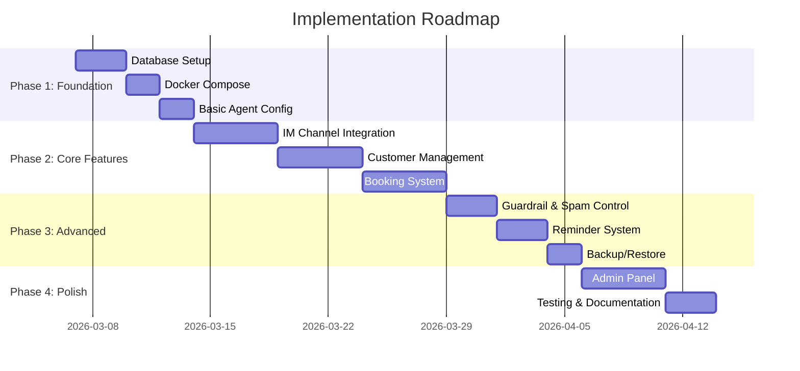

---

## 13. Summary

This design provides a complete customer service agent system with:

- ✅ **Multi-container deployment** with shared mounted volumes
- ✅ **PostgreSQL-backed** user account system with IM mapping
- ✅ **Role-based access control** (Admin vs Customer)
- ✅ **Unified customer identity** across Telegram, WhatsApp, Discord
- ✅ **Business functions**: Service query, booking, appointments, reminders
- ✅ **Operation history** with full audit trail
- ✅ **Backup/restore** functionality
- ✅ **Topic guardrails** for beauty salon focus
- ✅ **Spam control** with rate limiting and content filtering

---

**Next Steps:**
1. Review and confirm design
2. Set up development environment
3. Begin Phase 1 implementation