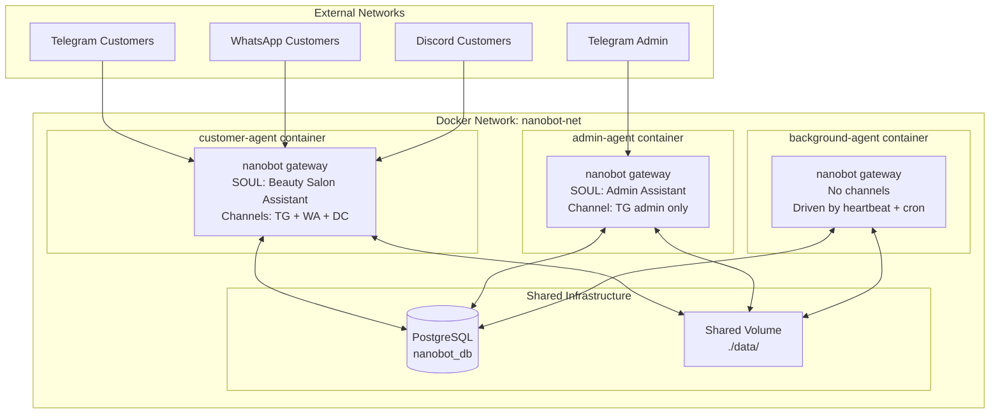

# Beauty Salon Agent System — Design Overview

**Date:** 2026-03-07
**Platform:** nanobot + PostgreSQL + Docker

---

## Document Index

| File | Contents |
|------|----------|
| [00-overview.md](./00-overview.md) | This file — system summary, architecture diagram, agent responsibilities |
| [01-nanobot-mechanics.md](./01-nanobot-mechanics.md) | How nanobot works internally, what each workspace file does |
| [02-database-schema.md](./02-database-schema.md) | PostgreSQL schema — all tables with SQL definitions |
| [03-agent-configs.md](./03-agent-configs.md) | Per-agent workspace files (SOUL.md, AGENTS.md, HEARTBEAT.md) and config.json |
| [04-message-flow.md](./04-message-flow.md) | Message pipeline, IM resolution, customer context loading, rate limiting |
| [05-background-agent.md](./05-background-agent.md) | Background Agent — cron jobs, conversation summarisation, reminders, cleanup |
| [06-security.md](./06-security.md) | Guardrails, spam control, duplicate prevention, audit trail |
| [07-docker-deployment.md](./07-docker-deployment.md) | docker-compose.yml, volume structure, environment variables |
| [08-roadmap.md](./08-roadmap.md) | Implementation phases and task breakdown |

---

## 1. Executive Summary

A multi-container customer service system built on nanobot for a beauty salon. Three nanobot instances run in Docker, each with its own workspace and configuration:

- **Customer Agent** — handles Telegram, WhatsApp, Discord customer conversations
- **Admin Agent** — handles owner/admin operations via a private Telegram channel
- **Background Agent** — no IM channels; driven by heartbeat and cron to do all background work

All three share a PostgreSQL database and a mounted volume.

---

## 2. High-Level Architecture

---

## 3. Agent Responsibilities

### Customer Agent

- Receive messages from Telegram, WhatsApp, Discord
- Resolve IM sender to a customer record in DB
- Inject per-customer memory from `customer_memory` table into context
- Handle service queries, bookings, appointment changes
- Enforce topic guardrail and rate limits (via AGENTS.md instructions)
- After responding: update last-message timestamp in DB for idle detection

### Admin Agent

- Receive messages from a private admin Telegram channel only
- Full access to customer records, appointments, settings
- Trigger backups, restore, view audit logs
- Receive daily summary reports from Background Agent

### Background Agent

- No IM channels — never talks to customers directly
- Driven entirely by `HEARTBEAT.md` periodic tasks and `cron` jobs
- Summarise idle customer conversations → write to `customer_memory` table
- Send appointment reminders via the `message` tool (targeting the right channel)
- Generate daily report and deliver to Admin Agent's channel
- Run nightly data cleanup

---

## 4. Key Design Decisions

### Why `customer_memory` table instead of nanobot's built-in MEMORY.md

nanobot's `MEMORY.md` is one file per workspace. With hundreds of customers sharing the Customer Agent workspace, all memories would merge into one file. The `customer_memory` table stores one summary per customer. The Customer Agent injects the relevant customer's memory into context at message time via `IDENTITY.md` (written fresh per customer — see §04).

### Why sessions stay as JSONL files (no `conversations` table)

nanobot already stores conversation history as JSONL files in `workspace/sessions/`, keyed by `channel:chat_id`. This is nanobot's native mechanism. The Background Agent reads these files directly from the shared volume to detect idle sessions and generate summaries. No parallel DB table needed.

### Why Background Agent uses heartbeat + cron instead of a custom polling loop

nanobot's built-in `CronService` supports `every`, `at`, and cron expressions with timezone. The `HeartbeatService` checks `HEARTBEAT.md` on a configurable interval. These two mechanisms together cover all Background Agent needs without any custom code.

### Rate limiting via AGENTS.md, not DB queries

nanobot processes messages inside its async agent loop — there is no hook to inject a DB query before each message without modifying core code. Rate limiting rules are enforced via instructions in `AGENTS.md`, with the agent counting recent messages using the `exec` tool (grep on session files) when needed.
