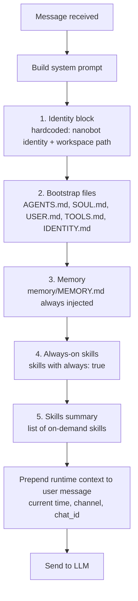
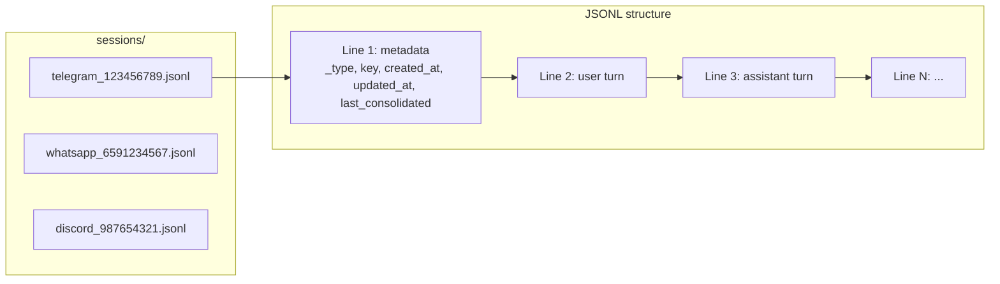
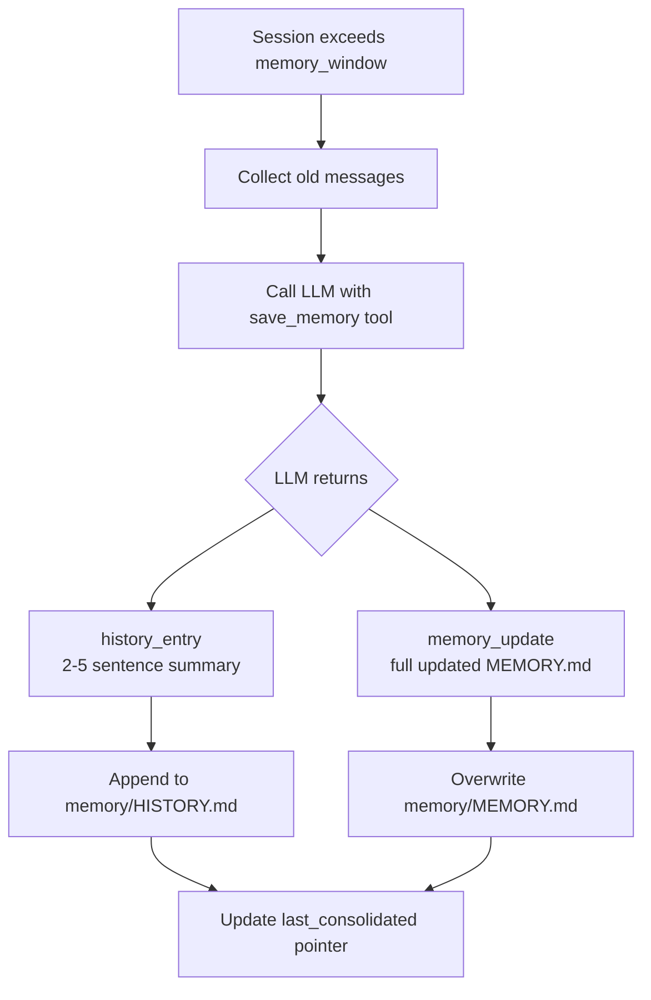
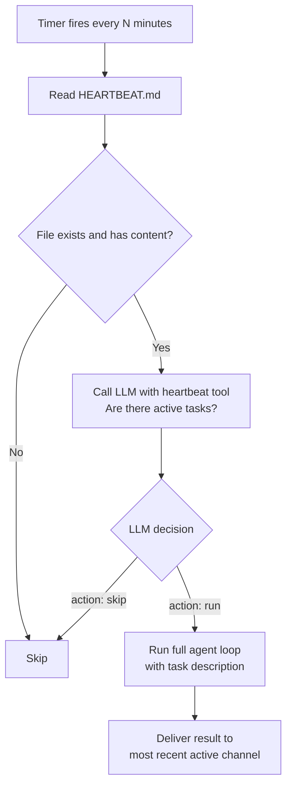
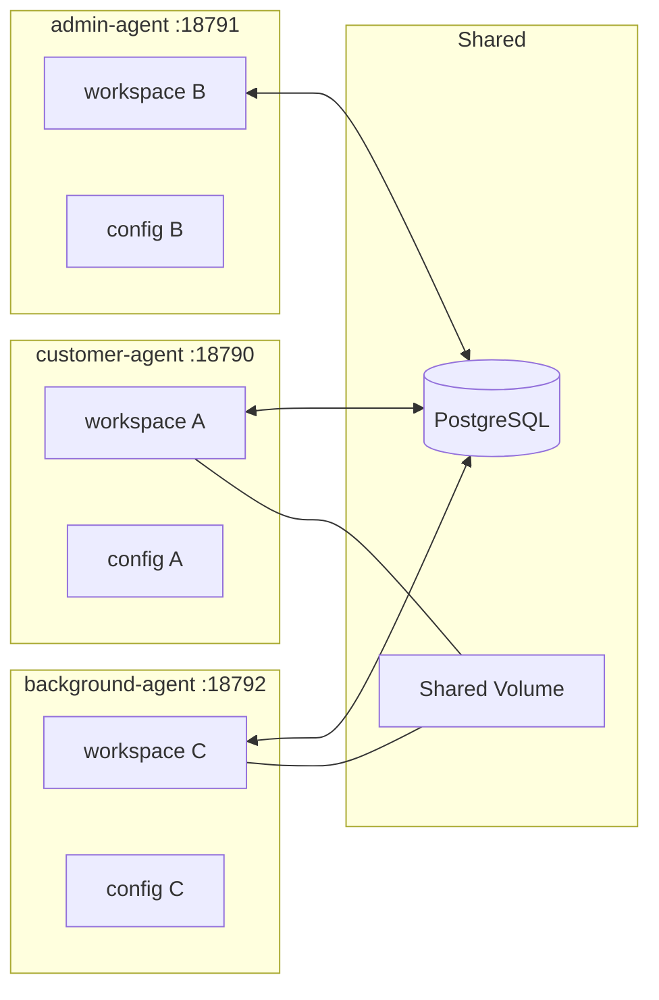

# nanobot Mechanics — How It Works

Understanding nanobot internals is essential before designing the beauty salon system on top of it.

---

## 1. System Prompt Assembly

Every time the agent processes a message, `ContextBuilder` assembles the system prompt in this order:



**Runtime context** (current time, channel name, chat_id) is prepended to each user message — not the system prompt.

---

## 2. Workspace File Reference

Each nanobot instance has a workspace directory. These files control its behaviour:

| File | Purpose | Who edits it |
|------|---------|--------------|
| `SOUL.md` | Agent personality, values, communication style | Us at deploy time |
| `AGENTS.md` | Operational instructions — how to handle tasks, business rules | Us at deploy time |
| `USER.md` | Profile of the person the agent serves | Us at deploy time (describes the salon, not a customer) |
| `TOOLS.md` | Notes on tool usage constraints | Usually left as default |
| `IDENTITY.md` | Injected per-request for dynamic context | Written programmatically per customer message |
| `memory/MEMORY.md` | Long-term persistent facts (auto-updated by LLM) | Auto-managed by nanobot |
| `memory/HISTORY.md` | Append-only event log, grep-searchable | Auto-managed by nanobot |
| `HEARTBEAT.md` | Periodic task list, checked on heartbeat interval | Us at deploy time + agent can edit |
| `sessions/*.jsonl` | Conversation history per channel:chat_id | Auto-managed by nanobot |
| `cron/jobs.json` | Scheduled cron jobs | Agent via `cron` tool |
| `skills/*/SKILL.md` | Custom skill definitions | Us at deploy time |

---

## 3. Session Storage

Sessions are stored as JSONL files at:

```
workspace/sessions/<channel>_<chat_id>.jsonl
```

Each file contains:
- A metadata line: `{"_type": "metadata", "key": "...", "created_at": "...", "updated_at": "...", "last_consolidated": N}`
- One JSON line per message turn

Session key format: `channel:chat_id` — e.g. `telegram:123456789`

The `updated_at` field in the metadata line is the idle detection signal used by the Background Agent.



---

## 4. Memory Consolidation

When a session exceeds `memory_window` (default 100) unconsolidated messages, nanobot automatically:

1. Takes the old messages
2. Calls the LLM with a `save_memory` tool definition
3. LLM returns: `history_entry` (2-5 sentence summary) + `memory_update` (updated MEMORY.md content)
4. Appends `history_entry` to `memory/HISTORY.md`
5. Overwrites `memory/MEMORY.md` with `memory_update`
6. Updates `session.last_consolidated` pointer

This is automatic — no code needed. The `/new` command triggers it immediately (archive_all mode).



**Problem for multi-customer use:** `MEMORY.md` is one file per workspace. All customer memories would merge. Solution: use `customer_memory` DB table + per-request `IDENTITY.md` injection (see §04).

---

## 5. Heartbeat Service

Runs on a configurable interval (default: every 30 minutes).



**For the Background Agent:** heartbeat interval is set to 5 minutes. `HEARTBEAT.md` contains the idle-check task.

---

## 6. Cron Service

Stores jobs in `workspace/cron/jobs.json`. Supports:

| Schedule type | Example |
|---|---|
| `every` | Every 5 minutes |
| `at` | Once at a specific ISO datetime |
| `cron` | Cron expression with optional IANA timezone |

Jobs have a `payload.message` — this is the task description sent to the agent loop when the job fires. If `deliver: true`, the result is sent to the configured channel + chat_id.

**For appointment reminders:** cron jobs are created by the Customer Agent when a booking is confirmed. Each job has `deliver: true` targeting the customer's channel and chat_id.

---

## 7. Multi-Instance Support

Run multiple nanobot instances with:

```bash
nanobot gateway -w /path/to/workspace -c /path/to/config.json -p PORT
```



Each instance has completely isolated:
- Workspace (sessions, memory, heartbeat, cron jobs, skills)
- Configuration (channels, model, system prompt files)
- Port

They share nothing by default — shared state goes through PostgreSQL and the mounted volume.

---

## 8. Built-in Tools Available to All Agents

| Tool | What it does |
|------|-------------|
| `read_file` | Read any file in workspace |
| `write_file` | Write/overwrite a file |
| `edit_file` | Edit file with old/new string replacement |
| `list_dir` | List directory contents |
| `exec` | Run shell commands (with safety limits) |
| `web_search` | Search the web (requires Brave API key) |
| `web_fetch` | Fetch a URL |
| `message` | Send a message to a specific channel:chat_id |
| `spawn` | Launch a subagent |
| `cron` | Add/list/remove scheduled jobs |

The `exec` tool is particularly powerful — agents can run `psql` commands to read/write PostgreSQL, grep session files, and run backup scripts.
