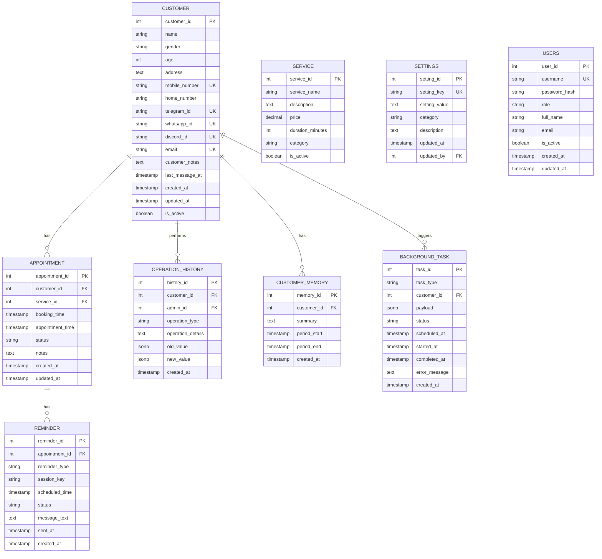

# Database Schema

**Database:** PostgreSQL 15
**Database name:** `nanobot_db`

Note: The `conversations` table was removed from the original design. nanobot stores raw conversation history natively as JSONL session files on the shared volume. The Background Agent reads these files directly.

---

## 1. ER Diagram



---

## 2. Table Definitions

### 2.1 customers

`last_message_at` is updated by the Customer Agent after every response. The Background Agent uses this field to detect idle conversations without scanning session files.

```sql
CREATE TABLE customers (
    customer_id     SERIAL PRIMARY KEY,
    name            VARCHAR(255),
    gender          VARCHAR(20),
    age             INT,
    address         TEXT,
    mobile_number   VARCHAR(50) UNIQUE,
    home_number     VARCHAR(50),
    telegram_id     VARCHAR(50) UNIQUE,
    whatsapp_id     VARCHAR(50) UNIQUE,
    discord_id      VARCHAR(50) UNIQUE,
    email           VARCHAR(255) UNIQUE,
    customer_notes  TEXT,
    last_message_at TIMESTAMP,
    is_active       BOOLEAN DEFAULT TRUE,
    created_at      TIMESTAMP DEFAULT NOW(),
    updated_at      TIMESTAMP DEFAULT NOW()
);

CREATE INDEX idx_customers_telegram      ON customers(telegram_id);
CREATE INDEX idx_customers_whatsapp      ON customers(whatsapp_id);
CREATE INDEX idx_customers_discord       ON customers(discord_id);
CREATE INDEX idx_customers_mobile        ON customers(mobile_number);
CREATE INDEX idx_customers_last_message  ON customers(last_message_at);
```

### 2.2 customer_memory

Summarised memory written by the Background Agent. One row per summarisation event per customer. The Customer Agent reads the latest summary to inject into context via `IDENTITY.md`.

This table exists because nanobot's `memory/MEMORY.md` is one file per workspace — unsuitable for hundreds of customers sharing a single Customer Agent instance.

```sql
CREATE TABLE customer_memory (
    memory_id    SERIAL PRIMARY KEY,
    customer_id  INT NOT NULL REFERENCES customers(customer_id),
    summary      TEXT NOT NULL,
    period_start TIMESTAMP NOT NULL,
    period_end   TIMESTAMP NOT NULL,
    created_at   TIMESTAMP DEFAULT NOW()
);

CREATE INDEX idx_customer_memory_customer ON customer_memory(customer_id);
CREATE INDEX idx_customer_memory_created  ON customer_memory(created_at);
```

### 2.3 background_tasks

Work item queue. Populated by the Customer Agent (e.g. idle conversation detected) and by cron jobs within the Background Agent itself (e.g. daily report). Background Agent polls and processes.

```sql
CREATE TYPE task_status AS ENUM ('pending', 'processing', 'completed', 'failed');
CREATE TYPE task_type AS ENUM (
    'summarise_conversation',
    'daily_report',
    'data_cleanup'
);

CREATE TABLE background_tasks (
    task_id       SERIAL PRIMARY KEY,
    task_type     task_type NOT NULL,
    customer_id   INT REFERENCES customers(customer_id),
    payload       JSONB,
    status        task_status DEFAULT 'pending',
    scheduled_at  TIMESTAMP DEFAULT NOW(),
    started_at    TIMESTAMP,
    completed_at  TIMESTAMP,
    error_message TEXT,
    created_at    TIMESTAMP DEFAULT NOW()
);

CREATE INDEX idx_background_tasks_status    ON background_tasks(status);
CREATE INDEX idx_background_tasks_type      ON background_tasks(task_type);
CREATE INDEX idx_background_tasks_scheduled ON background_tasks(scheduled_at);
```

Note: Appointment reminders are **not** in `background_tasks`. They use nanobot's native `CronService` — the Customer Agent registers a cron job when a booking is confirmed. The cron job fires and the Background Agent sends the reminder via the `message` tool.

### 2.4 services

```sql
CREATE TABLE services (
    service_id       SERIAL PRIMARY KEY,
    service_name     VARCHAR(255) NOT NULL,
    description      TEXT,
    price            DECIMAL(10, 2) NOT NULL,
    duration_minutes INT NOT NULL,
    category         VARCHAR(100),
    is_active        BOOLEAN DEFAULT TRUE,
    created_at       TIMESTAMP DEFAULT NOW(),
    updated_at       TIMESTAMP DEFAULT NOW()
);

INSERT INTO services (service_name, description, price, duration_minutes, category) VALUES
('Haircut',        'Professional haircut and styling',  35.00,  30, 'hair'),
('Hair Coloring',  'Full hair coloring service',        85.00, 120, 'color'),
('Hair Treatment', 'Deep conditioning treatment',       55.00,  45, 'treatment'),
('Manicure',       'Professional nail service',         25.00,  30, 'nails'),
('Pedicure',       'Foot nail care service',            30.00,  40, 'nails'),
('Facial',         'Deep cleansing facial',             65.00,  60, 'skincare');
```

### 2.5 appointments

Valid status values enforced by enum: `pending`, `confirmed`, `cancelled`, `completed`.

```sql
CREATE TYPE appointment_status AS ENUM ('pending', 'confirmed', 'cancelled', 'completed');

CREATE TABLE appointments (
    appointment_id   SERIAL PRIMARY KEY,
    customer_id      INT NOT NULL REFERENCES customers(customer_id),
    service_id       INT NOT NULL REFERENCES services(service_id),
    booking_time     TIMESTAMP DEFAULT NOW(),
    appointment_time TIMESTAMP NOT NULL,
    status           appointment_status DEFAULT 'pending',
    notes            TEXT,
    created_at       TIMESTAMP DEFAULT NOW(),
    updated_at       TIMESTAMP DEFAULT NOW()
);

CREATE INDEX idx_appointments_customer ON appointments(customer_id);
CREATE INDEX idx_appointments_time     ON appointments(appointment_time);
CREATE INDEX idx_appointments_status   ON appointments(status);
```

### 2.6 reminders

`session_key` stores the customer's nanobot session key (e.g. `telegram:123456789`) so the Background Agent knows which channel and chat_id to deliver the reminder to via the `message` tool.

Valid reminder_type values: `telegram`, `whatsapp`, `discord`.

```sql
CREATE TYPE reminder_channel AS ENUM ('telegram', 'whatsapp', 'discord');
CREATE TYPE reminder_status  AS ENUM ('pending', 'sent', 'failed');

CREATE TABLE reminders (
    reminder_id     SERIAL PRIMARY KEY,
    appointment_id  INT NOT NULL REFERENCES appointments(appointment_id),
    reminder_type   reminder_channel NOT NULL,
    session_key     VARCHAR(100) NOT NULL,
    scheduled_time  TIMESTAMP NOT NULL,
    status          reminder_status DEFAULT 'pending',
    message_text    TEXT,
    sent_at         TIMESTAMP,
    created_at      TIMESTAMP DEFAULT NOW()
);

CREATE INDEX idx_reminders_appointment ON reminders(appointment_id);
CREATE INDEX idx_reminders_scheduled   ON reminders(scheduled_time);
CREATE INDEX idx_reminders_status      ON reminders(status);
```

### 2.7 operation_history

Full audit trail. `admin_id` references `users.user_id` — NULL for customer-initiated actions.

```sql
CREATE TABLE operation_history (
    history_id        SERIAL PRIMARY KEY,
    customer_id       INT REFERENCES customers(customer_id),
    admin_id          INT REFERENCES users(user_id),
    operation_type    VARCHAR(50) NOT NULL,
    operation_details TEXT,
    old_value         JSONB,
    new_value         JSONB,
    created_at        TIMESTAMP DEFAULT NOW()
);

CREATE INDEX idx_operation_history_customer ON operation_history(customer_id);
CREATE INDEX idx_operation_history_type     ON operation_history(operation_type);
CREATE INDEX idx_operation_history_created  ON operation_history(created_at);
```

#### Operation types

| Operation | Type | Recorded data |
|-----------|------|---------------|
| Customer created | `customer_create` | new_value |
| Customer updated | `customer_update` | old_value, new_value |
| Appointment booked | `booking_create` | customer_id, appointment_id |
| Appointment modified | `booking_update` | old_value, new_value |
| Appointment cancelled | `booking_cancel` | appointment_id |
| Settings changed | `settings_update` | old_value, new_value, admin_id |
| Conversation summarised | `conversation_summarise` | customer_id, memory_id |

### 2.8 settings

```sql
CREATE TABLE settings (
    setting_id    SERIAL PRIMARY KEY,
    setting_key   VARCHAR(100) UNIQUE NOT NULL,
    setting_value TEXT,
    category      VARCHAR(50),
    description   TEXT,
    updated_at    TIMESTAMP DEFAULT NOW(),
    updated_by    INT REFERENCES users(user_id)
);

INSERT INTO settings (setting_key, setting_value, category, description) VALUES
('business_name',                'Beauty Salon', 'general',   'Business name'),
('business_hours_weekday',       '09:00-20:00',  'schedule',  'Weekday business hours'),
('business_hours_weekend',       '10:00-18:00',  'schedule',  'Weekend business hours'),
('appointment_buffer_minutes',   '30',            'booking',   'Minimum buffer between appointments'),
('max_advance_booking_days',     '30',            'booking',   'Maximum days ahead for booking'),
('reminder_before_hours',        '24',            'reminder',  'Hours before appointment to send reminder'),
('conversation_idle_minutes',    '15',            'background','Minutes idle before conversation is summarised'),
('guardrail_enabled',            'true',          'security',  'Enable topic guardrail'),
('rate_limit_per_minute',        '10',            'security',  'Maximum messages per minute per user'),
('rate_limit_per_hour',          '50',            'security',  'Maximum messages per hour per user'),
('daily_report_time',            '09:00',         'background','Time to deliver daily report to admin (HH:MM)'),
('cleanup_retention_days',       '90',            'background','Days to retain cancelled appointments');
```

### 2.9 users

> **Security note:** The default password hash below is for `admin123` — for development only. Must be changed before any deployment.

```sql
CREATE TYPE user_role AS ENUM ('owner', 'admin');

CREATE TABLE users (
    user_id       SERIAL PRIMARY KEY,
    username      VARCHAR(100) UNIQUE NOT NULL,
    password_hash VARCHAR(255) NOT NULL,
    role          user_role NOT NULL,
    full_name     VARCHAR(255),
    email         VARCHAR(255),
    is_active     BOOLEAN DEFAULT TRUE,
    created_at    TIMESTAMP DEFAULT NOW(),
    updated_at    TIMESTAMP DEFAULT NOW()
);

-- Default admin — CHANGE PASSWORD BEFORE DEPLOYMENT
INSERT INTO users (username, password_hash, role, full_name) VALUES
('admin', '$2b$12$LQv3c1yqBWVHxkd0LHAkCOYz6TtxMQJqhN8/X4.VT5YcG7RE.WbS', 'owner', 'System Owner');
```

---

## 3. Customer Duplicate Prevention

```sql
CREATE OR REPLACE FUNCTION check_customer_duplicate()
RETURNS TRIGGER AS $$
BEGIN
    IF EXISTS (
        SELECT 1 FROM customers
        WHERE (NEW.telegram_id IS NOT NULL AND telegram_id = NEW.telegram_id)
           OR (NEW.whatsapp_id IS NOT NULL AND whatsapp_id = NEW.whatsapp_id)
           OR (NEW.discord_id IS NOT NULL AND discord_id = NEW.discord_id)
           OR (NEW.mobile_number IS NOT NULL AND mobile_number = NEW.mobile_number)
    ) THEN
        RAISE EXCEPTION 'Customer with this IM account or phone already exists';
    END IF;
    RETURN NEW;
END;
$$ LANGUAGE plpgsql;

CREATE TRIGGER trg_customer_duplicate
    BEFORE INSERT ON customers
    FOR EACH ROW
    EXECUTE FUNCTION check_customer_duplicate();
```
