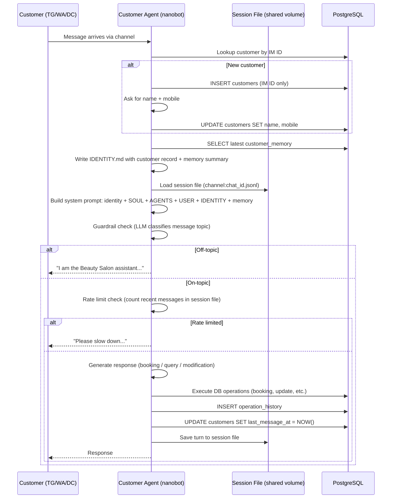
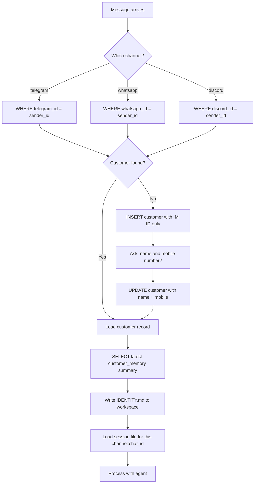
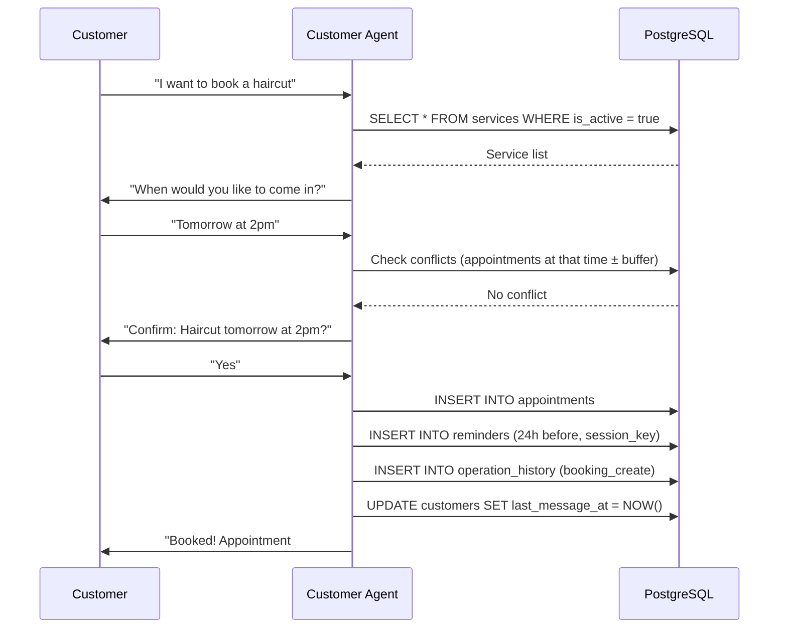

# Message Flow & Processing

---

## 1. Full Message Pipeline

Everything runs inside the nanobot agent loop. There is no separate guardrail service — all filtering, customer lookup, and context injection happen within the Customer Agent via instructions in `AGENTS.md` and the `IDENTITY.md` mechanism.



---

## 2. IM Account Resolution



---

## 3. Customer Context Loading

Context is loaded in two layers on every message:

**Layer 1 — Long-term memory (DB)**
The latest `customer_memory` summary is fetched and written to `IDENTITY.md` before the agent loop starts. This gives the agent the customer's history, preferences, and past appointment patterns.

**Layer 2 — Current session (JSONL file)**
nanobot automatically loads the session file for `channel:chat_id` and injects recent turns into the message history. This gives the agent the live conversation context.

Together: the agent always has both a long-term view (from DB) and the current conversation (from session file).

```
System prompt contains:
  └── IDENTITY.md  ← customer record + latest DB memory summary

Message history contains:
  └── sessions/telegram_123456789.jsonl  ← current conversation turns
```

---

## 4. IDENTITY.md Injection Mechanism

The `IDENTITY.md` file is part of nanobot's bootstrap file list (`ContextBuilder.BOOTSTRAP_FILES`). It is loaded into the system prompt automatically if it exists in the workspace.

Before each customer message is processed, a wrapper script (or the agent itself, on first message) overwrites `IDENTITY.md` with the current customer's data:

```
1. Receive message from channel (channel, sender_id, content)
2. Query DB: SELECT * FROM customers WHERE <channel>_id = sender_id
3. Query DB: SELECT summary FROM customer_memory WHERE customer_id = X ORDER BY created_at DESC LIMIT 1
4. Query DB: SELECT * FROM appointments WHERE customer_id = X AND status != 'cancelled' ORDER BY appointment_time
5. Write IDENTITY.md to workspace with above data
6. Route message to nanobot gateway (normal flow)
```

**Important:** Only one customer is active per message turn. `IDENTITY.md` is written atomically before the message is processed. Since nanobot serialises message processing via `_processing_lock`, there is no race condition.

---

## 5. Rate Limiting

Rate limiting is enforced via `AGENTS.md` instructions — no DB queries per-message.

The agent uses the `exec` tool to count recent messages in the session JSONL file when it suspects rate abuse:

```bash
# Count customer messages in the last 60 seconds
grep -c '"role": "user"' sessions/telegram_123456789.jsonl
```

For normal conversations this check is skipped entirely (no overhead). It is only triggered when the agent notices rapid successive messages — the LLM decides when to check based on the AGENTS.md instructions.

Configurable limits stored in the `settings` table:
- `rate_limit_per_minute`: 10 (default)
- `rate_limit_per_hour`: 50 (default)

---

## 6. Booking Flow



The reminder row in the `reminders` table includes `session_key` (e.g. `telegram:123456789`) so the Background Agent knows where to deliver it.

---

## 7. Appointment Modification

```
Customer: "I need to reschedule my appointment"
Agent: Queries appointments for this customer_id
Agent: "Your appointment is tomorrow at 2pm for a haircut. What would you like to change?"
Customer: "Change to 4pm"
Agent: Checks availability at 4pm
Agent: "Confirm: change to 4pm tomorrow?"
Customer: "Yes"
Agent: UPDATE appointments SET appointment_time = ..., updated_at = NOW()
Agent: INSERT operation_history (booking_update, old_value, new_value)
Agent: UPDATE reminders SET scheduled_time = ... WHERE appointment_id = X AND status = 'pending'
Agent: "Done! Your appointment is now at 4pm."
```
