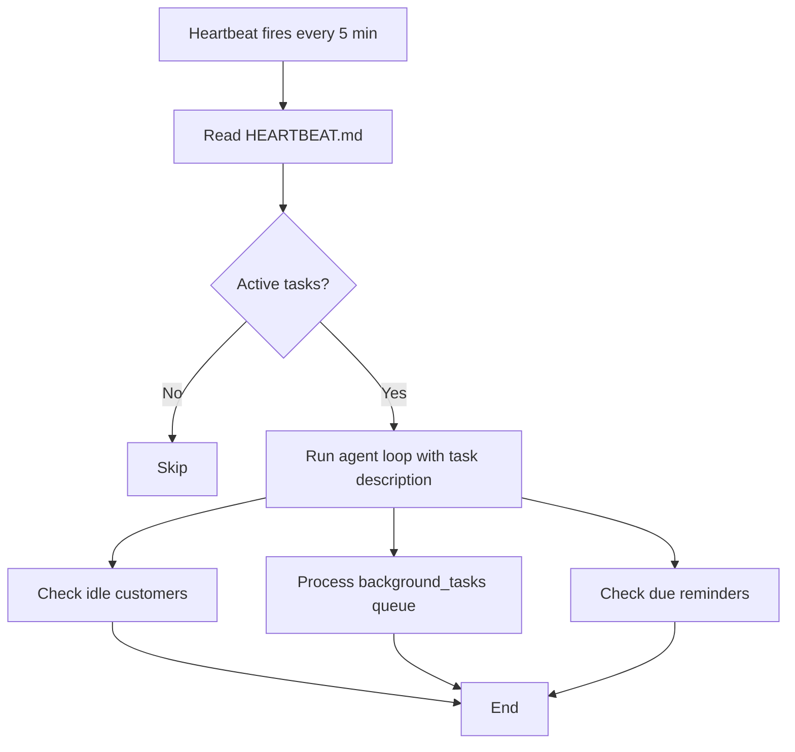
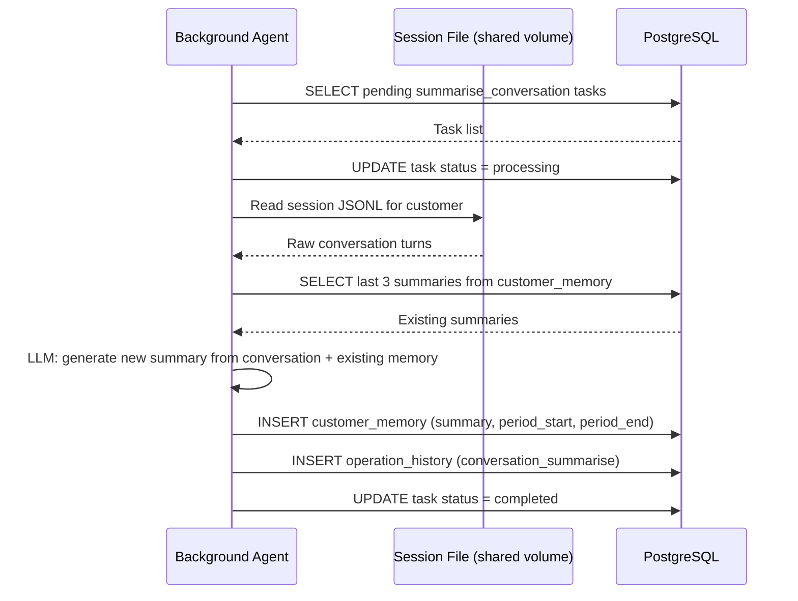

# Background Agent

The Background Agent runs as a nanobot gateway with no IM channels. It is driven entirely by:

- **Heartbeat** — wakes every 5 minutes, checks `HEARTBEAT.md` for active tasks
- **Cron jobs** — registered at startup for time-based scheduled work

It accesses the shared volume (session files) and PostgreSQL directly via the `exec` tool running `psql`.

---

## 1. Task Overview

| Task | Trigger | Frequency |
|------|---------|-----------|
| Idle conversation detection | Heartbeat | Every 5 min |
| Conversation summarisation | `background_tasks` queue | On detection |
| Appointment reminders | Heartbeat | Every 5 min |
| Daily report to admin | Cron (`0 9 * * *`) | Daily at 9am |
| Data cleanup | Cron (`0 2 * * *`) | Nightly at 2am |

---

## 2. Heartbeat Loop



`HEARTBEAT.md` always has three active tasks listed. The agent runs all three on every heartbeat tick.

---

## 3. Idle Conversation Detection

Runs on every heartbeat. Finds customers whose `last_message_at` is older than `conversation_idle_minutes` (default 15) and who do not already have a pending summarisation task.

```sql
SELECT customer_id, telegram_id, whatsapp_id, discord_id, last_message_at
FROM customers
WHERE last_message_at < NOW() - INTERVAL '15 minutes'
  AND last_message_at IS NOT NULL
  AND customer_id NOT IN (
      SELECT customer_id FROM background_tasks
      WHERE task_type = 'summarise_conversation'
        AND status IN ('pending', 'processing')
        AND created_at > NOW() - INTERVAL '1 hour'
  );
```

For each result, inserts a `background_tasks` row with the customer's session key in the payload.

---

## 4. Conversation Summarisation Flow



**What gets summarised:**
- Customer preferences (service types, timing preferences, allergies/sensitivities)
- Conversation topics and outcomes
- Any promises made or follow-ups needed
- Key facts the agent should remember

**What is NOT deleted:**
Session JSONL files are left intact — nanobot manages their lifecycle via its own consolidation mechanism (`/new` command or auto-consolidation at `memory_window`). The Background Agent only reads them.

---

## 5. Appointment Reminder Flow

Runs on every heartbeat. Finds reminders due within the next 10 minutes.

```sql
SELECT r.reminder_id, r.session_key, r.reminder_type, r.message_text,
       a.appointment_time, s.service_name, c.name AS customer_name
FROM reminders r
JOIN appointments a ON r.appointment_id = a.appointment_id
JOIN services s ON a.service_id = s.service_id
JOIN customers c ON a.customer_id = c.customer_id
WHERE r.status = 'pending'
  AND r.scheduled_time <= NOW() + INTERVAL '10 minutes';
```

For each due reminder, the agent uses the `message` tool to send directly to the customer:

```
message(
  channel = "telegram",       -- from session_key prefix
  chat_id  = "123456789",     -- from session_key suffix
  content  = "Hi Sarah! Just a reminder: your Haircut appointment is tomorrow at 2pm.
              Reply here if you need to make any changes."
)
```

Then updates the reminder status:

```sql
UPDATE reminders SET status = 'sent', sent_at = NOW() WHERE reminder_id = X;
```

On failure:

```sql
UPDATE reminders SET status = 'failed' WHERE reminder_id = X;
INSERT INTO operation_history (operation_type, operation_details) VALUES ('reminder_failed', '...');
```

---

## 6. Daily Report

Triggered by a cron job at `0 9 * * *` Asia/Hong_Kong. The agent collects:

```sql
-- Today's appointments
SELECT a.appointment_id, a.appointment_time, a.status,
       s.service_name, c.name AS customer_name
FROM appointments a
JOIN services s ON a.service_id = s.service_id
JOIN customers c ON a.customer_id = c.customer_id
WHERE DATE(a.appointment_time) = CURRENT_DATE
ORDER BY a.appointment_time;

-- New customers today
SELECT COUNT(*) FROM customers
WHERE DATE(created_at) = CURRENT_DATE;

-- Failed reminders today
SELECT COUNT(*) FROM reminders
WHERE DATE(sent_at) = CURRENT_DATE AND status = 'failed';

-- Stuck tasks (processing > 1 hour)
SELECT * FROM background_tasks
WHERE status = 'processing'
  AND started_at < NOW() - INTERVAL '1 hour';
```

Then sends a formatted report to the Admin Agent's Telegram channel via the `message` tool.

---

## 7. Nightly Data Cleanup

Triggered by cron at `0 2 * * *` Asia/Hong_Kong.

```sql
-- Remove old cancelled appointments
DELETE FROM appointments
WHERE status = 'cancelled'
  AND updated_at < NOW() - INTERVAL '90 days';

-- Remove old failed background tasks
DELETE FROM background_tasks
WHERE status = 'failed'
  AND created_at < NOW() - INTERVAL '30 days';

-- Log cleanup
INSERT INTO operation_history (operation_type, operation_details)
VALUES ('data_cleanup', 'Nightly cleanup completed: X appointments, Y tasks removed');
```

---

## 8. Cron Job Seeding

At first startup, these jobs should be pre-seeded in `background-agent/workspace/cron/jobs.json`:

```json
{
  "version": 1,
  "jobs": [
    {
      "id": "daily-report",
      "name": "Daily Report",
      "enabled": true,
      "schedule": {
        "kind": "cron",
        "expr": "0 9 * * *",
        "tz": "Asia/Hong_Kong"
      },
      "payload": {
        "kind": "agent_turn",
        "message": "Generate and send the daily report to the admin Telegram channel.",
        "deliver": false
      },
      "state": {},
      "createdAtMs": 0,
      "updatedAtMs": 0,
      "deleteAfterRun": false
    },
    {
      "id": "nightly-cleanup",
      "name": "Nightly Cleanup",
      "enabled": true,
      "schedule": {
        "kind": "cron",
        "expr": "0 2 * * *",
        "tz": "Asia/Hong_Kong"
      },
      "payload": {
        "kind": "agent_turn",
        "message": "Run the nightly data cleanup as described in AGENTS.md.",
        "deliver": false
      },
      "state": {},
      "createdAtMs": 0,
      "updatedAtMs": 0,
      "deleteAfterRun": false
    }
  ]
}
```
