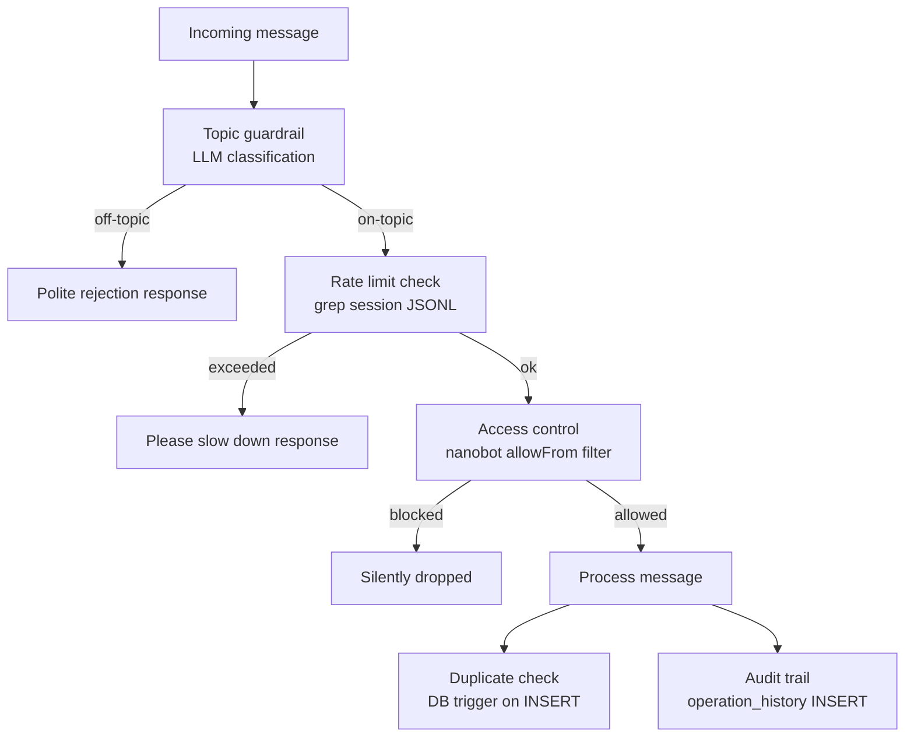

# Security & Guardrails



---

## 1. Topic Guardrail

Implemented via LLM classification instructions in the Customer Agent's `AGENTS.md`. The agent silently classifies each incoming message before responding.

**Why LLM classification instead of keyword matching:**
Keyword matching is brittle — customers can ask "what do you think about my hair?" (beauty-related) or "what are your opening hours?" in many ways. LLM classification handles paraphrasing, mixed languages (Cantonese/English/Mandarin), and ambiguous phrasing naturally.

**Allowed topics:**
- Beauty services: haircut, coloring, treatment, manicure, pedicure, facial
- Booking, appointments, scheduling, cancellations
- Pricing, service descriptions
- Salon hours, location
- Greetings, general chitchat about the salon

**Blocked topics:**
- Anything unrelated to the salon (politics, coding, finance, etc.)

**Response for blocked messages:**
> "I'm the Beauty Salon assistant. I can help with services, bookings, and appointments. Is there anything salon-related I can help you with?"

---

## 2. Spam & Rate Limiting

Rate limits are enforced via AGENTS.md instructions. The agent counts recent messages by examining the session JSONL file when it detects high message frequency.

**Limits (configurable in `settings` table):**

| Limit | Default |
|-------|---------|
| `rate_limit_per_minute` | 10 messages |
| `rate_limit_per_hour` | 50 messages |

**Response for rate-limited users:**
> "Please slow down — I can only handle one request at a time."

**Why not DB-backed rate limiting:**
nanobot has no pre-message hook for custom code injection. DB queries per-message would require modifying nanobot core. The AGENTS.md instruction approach adds zero overhead for normal conversations.

### How it works (implementation detail)

The rate limit check is embedded in AGENTS.md as an instruction the agent follows at the start of every response:

1. Agent receives a new message
2. Agent runs `exec` → `grep -c '"role":"user"' /app/workspace/session.jsonl` to count recent user turns
3. If count in the last 60 seconds exceeds `rate_limit_per_minute` (read once from `settings` at startup), respond with the slow-down message and stop
4. If count in the last 3600 seconds exceeds `rate_limit_per_hour`, same response
5. Otherwise, proceed normally

**The window resets automatically** — it's a sliding window over the session JSONL timestamps, not a counter that needs to be reset.

### Testability constraints

Because enforcement is LLM-instruction-based (not code), rate limiting **cannot be unit tested in Layers 1–3**. All rate limit tests live in Layer 5 (manual, requires real LLM). This is a known tradeoff — the alternative (modifying nanobot core) was rejected to keep the system self-contained.

The DB seed values (`rate_limit_per_minute`, `rate_limit_per_hour`) are tested in Layer 1 (`test_seed_data.py`) and Layer 2 (`test_workspace_files.py`) to confirm the values are present and the AGENTS.md references them — but the enforcement logic itself is only verified end-to-end.

### Edge cases the agent must handle

| Scenario | Expected behaviour |
|----------|--------------------|
| 11 messages in 60 s | Block on 11th, reply with slow-down message |
| 51 messages in 60 min | Block on 51st even if per-minute limit not exceeded |
| Wait 61 s after block, send one more | Unblocked — window has passed |
| Mix of on-topic and off-topic during burst | Off-topic rejected by guardrail first; rate limit counter still increments |
| Burst stops, then resumes 2 min later | Counter resets; user unblocked |
| Two different users bursting simultaneously | Each user's session JSONL is separate; limits are per-user |

---

## 3. Access Control

### Customer Agent

```json
"allowFrom": ["*"]
```

Open to all — any customer can message. The agent verifies identity via the DB lookup (IM ID → customer record).

### Admin Agent

```json
"allowFrom": ["${ADMIN_TELEGRAM_USER_ID}"]
```

Strict allowlist — only the owner's Telegram ID can interact. Any message from an unlisted sender is silently dropped by nanobot before reaching the agent loop.

### Background Agent

```json
"channels": {}
```

No channels at all — completely unreachable from external networks.

---

## 8. Tool Restrictions (`tools.disabled`)

`allowFrom` is message-level access control — it decides who can talk to the agent. But once a message is accepted, the LLM has access to all registered tools. A jailbreak or hallucination could cause the Customer Agent to call `write_file` or `exec`.

The solution is a `tools.disabled` list in `config.json` (a planned nanobot feature). Disabled tools are never registered in the tool registry — they don't appear in `get_definitions()`, so the LLM never knows they exist.

| Agent | Disabled tools | Reason |
|-------|---------------|--------|
| customer-agent | `write_file`, `edit_file`, `exec`, `cron`, `spawn` | Customers must never modify workspace files or run shell commands |
| admin-agent | _(none)_ | Owner needs full access |
| background-agent | `message` | Prevent unsolicited messages to customers outside of its remit |

This is a hard enforcement boundary — not an instruction the LLM can reason around.

---

## 4. Customer Duplicate Prevention

Enforced at the DB level via a trigger. Prevents duplicate records for the same IM account or phone number.

```sql
CREATE OR REPLACE FUNCTION check_customer_duplicate()
RETURNS TRIGGER AS $$
BEGIN
    IF EXISTS (
        SELECT 1 FROM customers
        WHERE (NEW.telegram_id IS NOT NULL AND telegram_id = NEW.telegram_id)
           OR (NEW.whatsapp_id IS NOT NULL AND whatsapp_id = NEW.whatsapp_id)
           OR (NEW.discord_id IS NOT NULL AND discord_id = NEW.discord_id)
           OR (NEW.mobile_number IS NOT NULL AND mobile_number = NEW.mobile_number)
    ) THEN
        RAISE EXCEPTION 'Customer with this IM account or phone already exists';
    END IF;
    RETURN NEW;
END;
$$ LANGUAGE plpgsql;

CREATE TRIGGER trg_customer_duplicate
    BEFORE INSERT ON customers
    FOR EACH ROW
    EXECUTE FUNCTION check_customer_duplicate();
```

---

## 5. Operation Audit Trail

Every significant action is logged to `operation_history`. This gives the admin a full audit log.

| Operation | Type | Who | Data logged |
|-----------|------|-----|-------------|
| Customer created | `customer_create` | Customer Agent | new customer record |
| Customer updated | `customer_update` | Customer / Admin Agent | old + new values |
| Appointment booked | `booking_create` | Customer Agent | customer_id, appointment_id |
| Appointment modified | `booking_update` | Customer / Admin Agent | old + new appointment values |
| Appointment cancelled | `booking_cancel` | Customer / Admin Agent | appointment_id |
| Settings changed | `settings_update` | Admin Agent | old + new values, admin_id |
| Conversation summarised | `conversation_summarise` | Background Agent | customer_id, memory_id |
| Reminder sent | `reminder_sent` | Background Agent | reminder_id |
| Reminder failed | `reminder_failed` | Background Agent | reminder_id, error |
| Data cleanup | `data_cleanup` | Background Agent | summary of rows deleted |

---

## 6. Secrets Management

All sensitive values are injected via environment variables — never hardcoded in config files.

| Variable | Used by |
|----------|---------|
| `ANTHROPIC_API_KEY` | All agents |
| `CUSTOMER_TELEGRAM_TOKEN` | Customer Agent |
| `ADMIN_TELEGRAM_TOKEN` | Admin Agent |
| `ADMIN_TELEGRAM_USER_ID` | Admin Agent (allowFrom) |
| `DISCORD_TOKEN` | Customer Agent |
| `DB_PASSWORD` | All agents (in DATABASE_URL) |
| `DATABASE_URL` | All agents (psql access) |

These are defined in a `.env` file (gitignored) and passed through `docker-compose.yml` environment blocks.

---

## 7. Database User Permissions

The `nanobot` DB user should have only the permissions it needs:

```sql
-- Create restricted user
CREATE USER nanobot_app WITH PASSWORD '...';

-- Grant DML on application tables only
GRANT SELECT, INSERT, UPDATE, DELETE ON ALL TABLES IN SCHEMA public TO nanobot_app;
GRANT USAGE, SELECT ON ALL SEQUENCES IN SCHEMA public TO nanobot_app;

-- Do NOT grant: DROP, TRUNCATE, CREATE TABLE, ALTER TABLE
```

Admin DB operations (schema changes, backup) are run with a separate privileged user.
