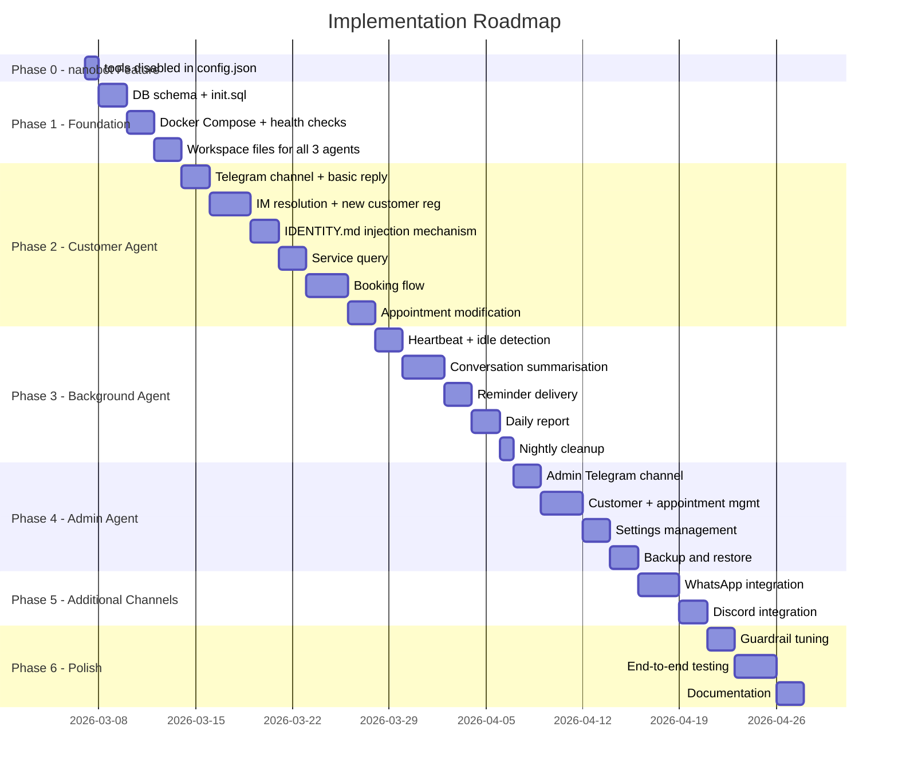
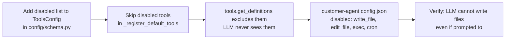
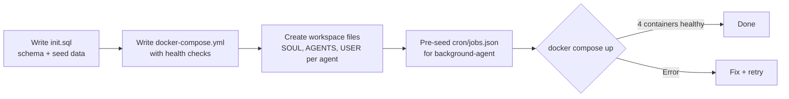
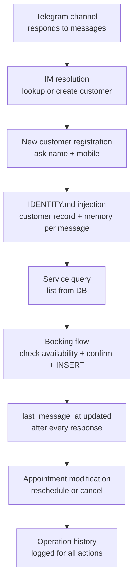
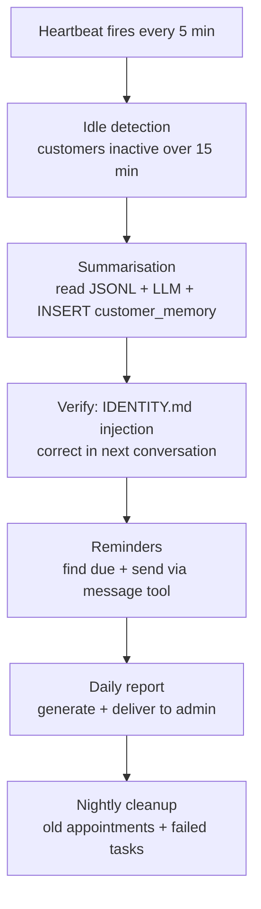
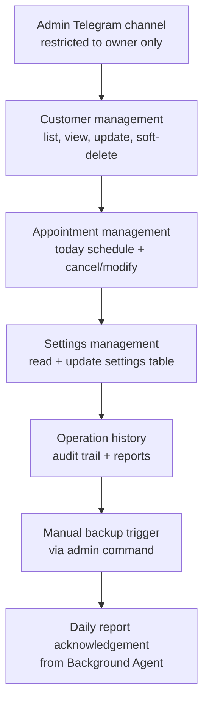
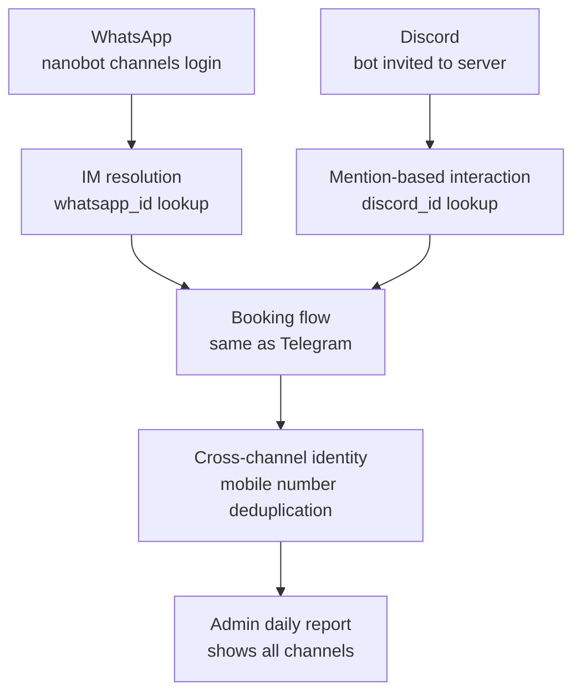
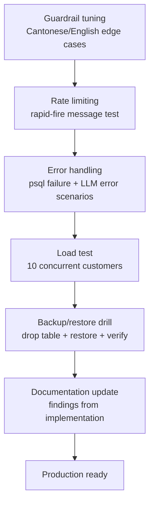

# Implementation Roadmap

---

## Phases



---

## Phase 0 — nanobot Feature: `tools.disabled`

**Goal:** Hard-enforce tool restrictions per agent instance via config, so the LLM cannot call disallowed tools regardless of what it's instructed to do.



**Why:** `allowFrom` only controls who can send messages. Once a message reaches the agent loop, all tools are available to the LLM. A jailbreak or hallucination could cause the Customer Agent to call `write_file` or `exec`. With `tools.disabled`, those tools are never registered — they don't exist from the LLM's perspective.

**nanobot changes required:**

1. `nanobot/config/schema.py` — add `disabled: list[str]` to `ToolsConfig`
2. `nanobot/agent/loop.py` — pass `disabled` into `AgentLoop.__init__`, skip disabled tools in `_register_default_tools`

**Customer Agent `config.json` addition:**

```json
"tools": {
  "disabled": ["write_file", "edit_file", "exec", "cron", "spawn"]
}
```

This leaves the Customer Agent with only: `read_file`, `list_dir`, `web_search`, `web_fetch`, `message`.

- [ ] Add `disabled: list[str]` to `ToolsConfig` in `nanobot/config/schema.py`
- [ ] Read `disabled` in `AgentLoop._register_default_tools` and skip those tools
- [ ] Add `tools.disabled` to customer-agent `config.json`
- [ ] Verify: attempt to call `write_file` from customer-agent returns tool-not-found error

**Done when:** Customer Agent cannot write or execute anything, even if the LLM tries.

---

## Phase 1 — Foundation

**Goal:** Running infra with empty agents.



- [ ] Write `init.sql` with full schema (all tables, enums, indexes, trigger, seed data)
- [ ] Write `docker-compose.yml` with health checks
- [ ] Create workspace directories and initial workspace files for all 3 agents
  - `SOUL.md`, `AGENTS.md`, `USER.md` per agent
  - `HEARTBEAT.md` for background-agent
  - Pre-seeded `cron/jobs.json` for background-agent
- [ ] Verify all 3 containers start and connect to postgres

**Done when:** `docker compose up` starts all 4 containers with no errors.

---

## Phase 2 — Customer Agent

**Goal:** Customer can book an appointment end-to-end via Telegram.



- [ ] Telegram channel responds to messages
- [ ] IM resolution: lookup customer by telegram_id, create new record if not found
- [ ] Ask new customer for name + mobile, update DB
- [ ] IDENTITY.md injection: write customer record + memory before each message
- [ ] Service query: list services from DB
- [ ] Booking flow: check availability, confirm, INSERT appointment, INSERT reminder
- [ ] `last_message_at` updated after every response
- [ ] Appointment modification: reschedule or cancel
- [ ] Operation history logged for all booking actions

**Done when:** A new Telegram user can go from first message → registered customer → confirmed appointment.

---

## Phase 3 — Background Agent

**Goal:** Conversations are summarised, reminders are sent.



- [ ] Heartbeat fires every 5 min and processes `HEARTBEAT.md` tasks
- [ ] Idle detection query finds customers inactive > 15 min
- [ ] Summarisation: reads session JSONL, generates summary, inserts `customer_memory`
- [ ] Customer Agent injects latest `customer_memory` into IDENTITY.md correctly
- [ ] Reminders: finds due reminders, sends via `message` tool, updates status
- [ ] Daily report: generates and delivers to admin Telegram channel
- [ ] Nightly cleanup: removes old cancelled appointments and failed tasks

**Done when:** After a test conversation, the session is summarised within 20 min and the summary appears correctly in the next conversation's IDENTITY.md.

---

## Phase 4 — Admin Agent

**Goal:** Owner can manage the system via Telegram.



- [ ] Admin Telegram channel responds (allowFrom restricted to owner)
- [ ] Customer management: list, view, update, soft-delete customers
- [ ] Appointment management: view today's schedule, cancel/modify on behalf of customer
- [ ] Settings: read and update `settings` table values
- [ ] View operation history and audit trail
- [ ] Trigger backup manually
- [ ] Receive and acknowledge daily reports from Background Agent

**Done when:** Owner can view today's appointments and cancel one via Telegram.

---

## Phase 5 — Additional Channels

**Goal:** WhatsApp and Discord customers work the same as Telegram.



- [ ] WhatsApp: link device (`nanobot channels login`), test IM resolution and booking
- [ ] Discord: bot invited to server, mention-based interaction, booking flow
- [ ] Cross-channel identity: if a WhatsApp customer also connects via Telegram, they are recognised as the same customer by mobile number

**Done when:** A booking made via WhatsApp shows up in the admin's daily report alongside Telegram bookings.

---

## Phase 6 — Polish

**Goal:** System is production-ready.



- [ ] Guardrail tuning: test edge cases (mixed Cantonese/English, ambiguous messages)
- [ ] Rate limiting: test with rapid-fire messages
- [ ] Error handling: what happens if psql fails? If LLM returns error?
- [ ] Load test: simulate 10 concurrent customers
- [ ] Backup/restore drill: backup, drop a table, restore, verify
- [ ] Documentation: update this design with anything discovered during implementation

---

## Key Risks

| Risk | Mitigation |
|------|-----------|
| `IDENTITY.md` write race condition | nanobot serialises processing via `_processing_lock`; only one message processed at a time per agent instance |
| Background Agent reads stale session file | `last_message_at` DB field is the idle signal — always accurate regardless of session file state |
| psql not available in nanobot image | Add `postgresql-client` to Dockerfile; or use Python `psycopg2` via `exec` |
| LLM generates invalid SQL | Agent uses parameterised queries as much as possible; critical paths have confirmation steps |
| WhatsApp session expires | `nanobot channels login` must be re-run; document the recovery procedure |
| Reminder delivery fails | Retry not implemented in Phase 1 — failed reminders are logged and surfaced in daily report |
